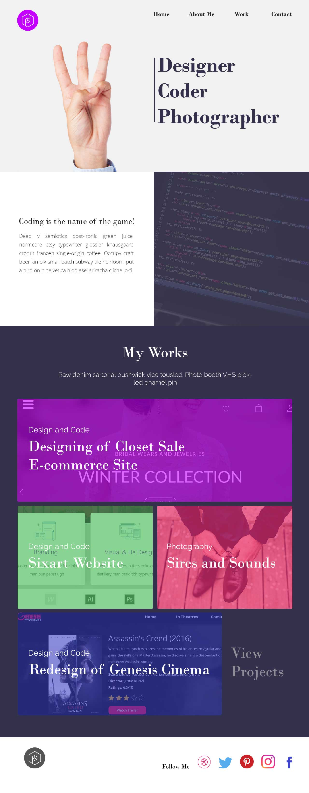

# Developer
A portfolio site showing my array of talents as a Designer, Front-end Coder and Photographer

This is a personal portfolio site inspired by the 12 in 12 challenge tutorial by @mackenziechild. It also shows some of my other works that are either completed or still in the kitchen. Note: The site is not responsive and design may differ slightly from the site.

<h3>Assets Used</h3>

Fonts: Bodoni MT and Lato
